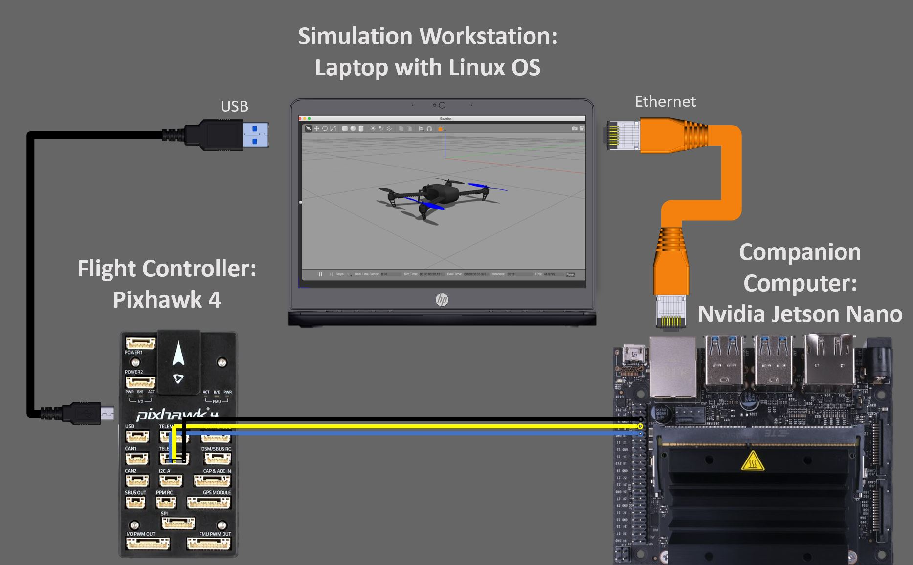
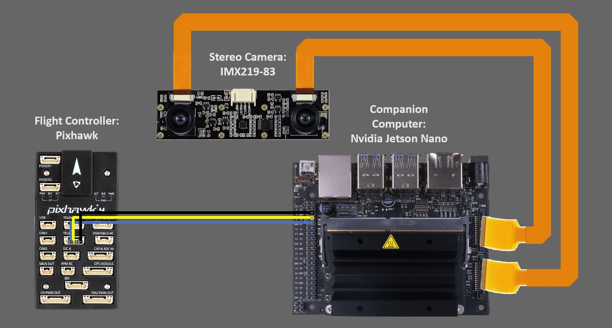
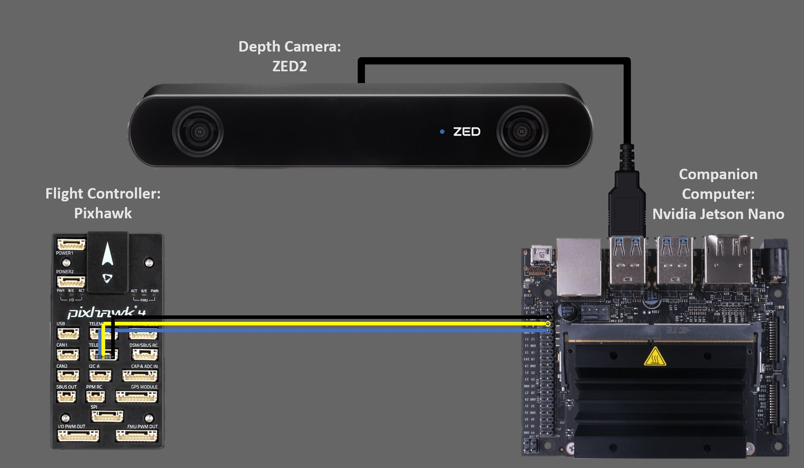
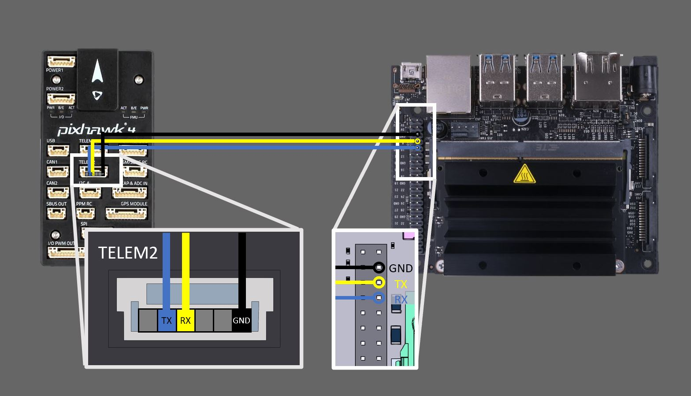

# Docker Image for Avoidance on Companion Computer #

This repository contains a Dockerfile which ships the PX4 avoidance code with all dependencies. This code was testet on Nvidia Jetson Nano with a Pixhawk 4 on PX4.

This image enables you to run the avoidance code on a nvidia Jetson Nano 

# Table of Contents #
* [Hardware Requirements](#Hardware-Requirements)
* [Getting Started](#Getting-started)
  * [Prerequisites](#prerequisites)
    * [Install Image on Nvidia Jetson Nano](#Install-Image-on-Nvidia-Jetson-Nano)
    * [Wiring](#wiring)
       * [UART Connection between nvidia jetson nano and pixhawk](#UART-Connection-between-nvidia-jetson-nano-and-pixhawk)
       * [HITL Simulation](#hitl-wiring)
       * [Stereo Camera](#stereo-camera-wiring)
       * [Depth Camera](#depth-camera)
    * [Prepare Pixhawk](#prepare-pixhawk)
  * [Run the avoidance code](#Run-the-avoidace-code)
    * [HITL Simulation](#run-avoidance-in-hitl-simulation)
    * [Stereo Camera](#run-avoidance-with-stereo-camera)
    * [Depth Camera](#run-avoidance-with-depth-camera)
  * [Start Avoidance from Boot](#start-avoidance-from-boot)
* [Troubleshooting](#troubleshooting)
  * [Security](#security)
* [Architecture Diagrams](#Architecture-Diagrams)
  * [Docker Images](#docker-images)
  * [HITL Simluation](#hitl-simulation)
  * [Depth Camera](#depth-camera-architecture)
  * [Stereo Camera](#stereo-camera-architecture)

### Hardware Requirements ###
TODO

| HITL        | Stereo           | Depth  |
| ------------- |:-------------:| -----:|
|     |  |  |


# Getting Started #
## Prerequisites ##
### Install Install Image on Nvidia Jetson Nano ###
The Process to install the Image on the nvidia jetson nano is well ducumented on the [nvidia page](https://developer.nvidia.com/embedded/learn/get-started-jetson-nano-devkit). Docker is included in the jetson image. The Docker installation can be verified using the following command:
```
docker run -it hello-world
```
### Wiring ###
The Companion Computer can operate in different modes: HITL Simulation or real world flying with an attached depth camera or a stereo camera. This section shows the wiring instuctions for each mode.
#### UART Connection between nvidia jetson nano and pixhawk ####
For all modes you need to connect the pixhawk flightcontroller to the companion computer via the UART Interface. 

Information about the pixhawk pins are available [here](http://www.holybro.com/manual/Pixhawk4-Pinouts.pdf)
Information anout the nvidia jetson nano pins are available [here](https://www.jetsonhacks.com/nvidia-jetson-nano-j41-header-pinout/).
#### HITL Simulation ####
To enable HITL Simulation you need to connect the companion computer and the pixhawk to the simulation workstation.

#### Stereo Camera ####
The Stereo Camera can be attached to the jetson nano using the onboard camera ports. Be aware, that only the B01 version of the jetson nano development kit provides two camera ports.

#### Depth Camera ####
In this project we use the ZED2 depth camera, which can be attached to the companion computer by using the usb3 interface. 

### Prepare the Pixhawk ###
* Install the newest PX4 Firmware
* If you want to use the Pixhawk in HITL Mode you can use the parameter file from the [HITL Repository](https://bitbucket.org/wil_ly/deepdrone-workstation/src/master/).

Docker installation (Should be included in the base nvidia Image)
### 1. Wiring ###

### 2. OS / Firmware Installation ###
* Install newest PX4 Firmware on Pixhawk 4. Your can follow these [instructions](https://docs.px4.io/master/en/config/firmware.html) to install
  * Install the parameters on the Pixhawk using the parameter file
* Install your favorite Linux Distribution on your Workstation. We 
*  

## Run the avoidance code? ##

### Clone repository ###

```
git clone git@github.com:PerpetuumProgress/DeepDrone-Companion-Computer.git
```

### Run the container ###

```
./run_container.sh -c stereo_hitl -p local_planner
```


### Troubleshooting ###
TODO
