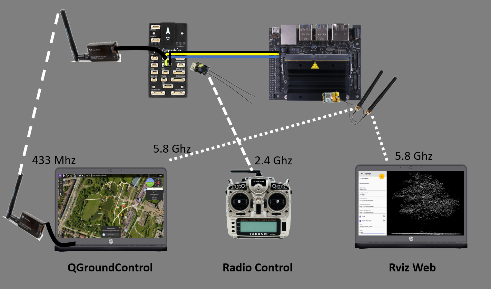

# Dockerized Px4 Obstacle Avoidance #

  This project was developed as part of the [deep drone challenge](https://brigkair.digital/ddc/) and solves the Pathfinder task. The Pathfinder task requires the drone to avoid obstacles on a given track. The track confronts the drone with physical obstacles and virtual obstacls. The virtual obstacles are represented as aruco markers on the track. The drones task is to detect those markers and avoid a given airspace around them. The size and shape of the airspace depends on the aruco id and was given as 3d models. Examples of the virtual obstacles can be found in a section [below](#virtual-obstacle-examples)
 
  This project packs all dependencies of the [px4 computer vision algorithms](https://github.com/PX4/PX4-Avoidance) into Dockercontainer, which enables every px4 based drone to avoid obstacles. 
 A bash file is provided to run the project with a single line of code.

This code was testet on Nvidia Jetson Nano with a Pixhawk 4 with a zed2 depth camera.

# Table of Contents #
* [Hardware Requirements](#Hardware-Requirements)
* [Getting Started](#Getting-started)
  * [1. Wiring](#1-wiring)

  * [2. Install Operating System and Firmware](#2-install-operating-system-and-firmware)

  * [3. Clone Repository & configure PX4](#Run-the-avoidace-code)

  * [4. Start Avoidance from Boot](#4-start-avoidance-from-boot)
* [Architecture Diagrams](#architecture-diagrams)

# Hardware Requirements #

1. Drone Frame with motors e.g. Holybro S500
2. Px4 compatible flightcontroller: [list of compatible hardware](https://docs.px4.io/v1.12/en/flight_controller/)
3. Depth Camera: [Zed2](https://www.stereolabs.com/zed-2/)
4. Companion Computer: [Nvidia Jetson Nano](https://www.nvidia.com/de-de/autonomous-machines/embedded-systems/jetson-nano/)
5. Wifi Antenna for communication with Ground Control Station.(optional)
6. Remote Control e.g. FrSky Taranis 9xd
7. Telemetry Module for communication with Groud Control Station(optional) e.g. [Holybro Radio Module](http://www.holybro.com/product/transceiver-telemetry-radio-v3/)
# Getting Started #

## 1. Wiring ##
The wiring is simple: The Pixhawk needs to be connected to the companion computer via UART  and the camera needs to be connected to the companion computer via USB3.


## 2. Install Operating System and Firmware ##
* Install latest PX4 Firmware on Pixhawk 4. Your can follow these [instructions](https://docs.px4.io/master/en/config/firmware.html)

*  Install the operating system on the companion computer. The installation process is well documented on the [nvidia getting started page](https://developer.nvidia.com/embedded/learn/get-started-jetson-nano-devkit)

## 3. Run the avoidance code ##
 To start the avoidance code you simply clone this repository and run the Bash script.
### Clone repository ###
```
git clone git@bitbucket.org:wil_ly/deepdrone-cc.git
```
### Run the container ###
```
./run.bash
```
# Architecture Overview #

## Virtual Obstacle Examples ##
The table below shows three virtual obstacles with their corresponding aruco marcer. Each 3d model, which represents an airspace which should be avoided by the drone was converted into a pointcloud and is published by the "Virtual Obstracle" rosnode as soon as the Aruco Marker is detected. The Message Flow Section below explans the message flow in detail.

|  Name   |          Aruco ID         |               Picture                |  
|---------|---------------------------|--------------------------------------|
| Cloud   |   |        |
| Asteroid|     |  |
| Church  |   |      | 

## Message Flow ##


1. Flight Controller publishes desired flight path via UART to the companion computer. The mavros node listens on the serial interface and publishes the the path as ROS topic.

2. Local planner subscribes to the desired path topic.

3. Zed Wrapper node publishes the pointcloud and rgb image data

4. The Aruco Detect node subscribes to the rgb camera image, detects aruco marker and publishes their ids and transformations(Translation and rotation from camera point of view)

5. The Virtual Obstacle node subscribes to the Aruco id and Transformations. It identifies the virutual obstacle transforms a preprocessed pointcloud  the  the corresponding  pointcloud of the virtual obstacle in the camera frame and publishes the transformed pointcloud.

6. The Local Planner Node subscribes to both pointclouds and checks whether the desired path conflicts with the obstacles in the point cloud. The local planner node calculates a new path and publishes the generated path

7. The Mavros node subscribes to the generated path from the local Planner node and sends it back to the flightcontroller which adusts ist trajectory accordingly.

# Control and Monitoring #
There are 3 ways to monitor and control the flight remotly.


## 1. RVizWeb  ##
This project comes with a preconfigured RVizWeb instance, which listens on port 8001 on the companion computer. RVizWeb can be used to subscribe to any ROS topic and its soley purpuse is to monitor the obstacle detection of the drones. The provided configuration displays the camera feed and the pointclouds. The Camera feed of the aruco detect node, can be used to monitor the aruco detection. 
## 2. Qgroundcontrol Via telemetry or wifi ##
To control the drone, plan missions,
configure flightcontroller
 or to switch flight modes you can use [Qgroudcontrol](http://qgroundcontrol.com/).
There are two ways to connect to the drone to Qgroudcontrol. 
   - WIFI (5.8 ghz)\
   The mavros node provides a wifi bridge to connect to Qgroundcontrol. This node broadcasts to all network members udp packages on port 14550 and listens on port 14555 for Qgroundcontrol binding. Make sure, that ýou share a network with the drone and enable udp in the qground control settings. 
   - Telemetry module (433mhz)\
   To use the telemetry radio simple connect the radio dongle via usb to your computer and connect the counter part to your drine via uart. 
   Now select SiK Radio in your QGroundControl settings.
    
## 3. Radio telemetry ##
Last but not least the drone can obviously be controlled via the remote control. The remote control can be used to steer the drone in manual mode e.g. position mode or switch to mission mode to start autonomous flight. If your remote and receiver supports telemetry, you can even receive information like Battery level, Position or velocity.

